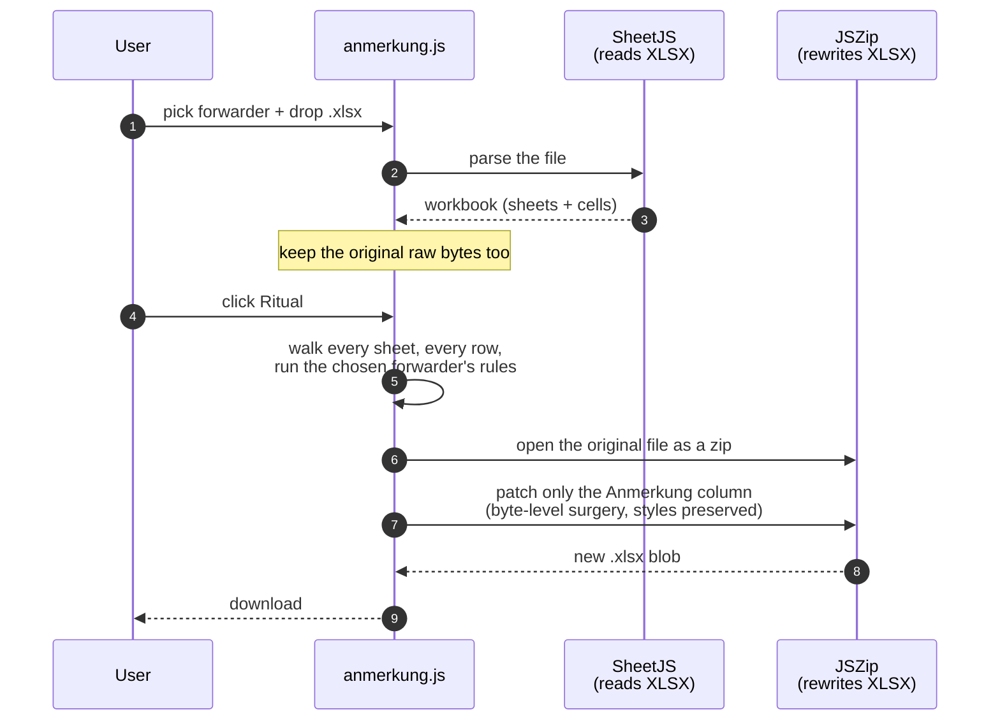
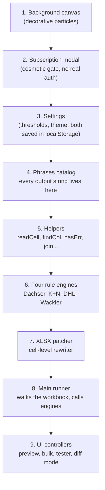
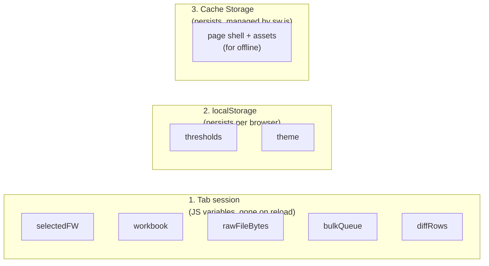

# Anmerkung Processor — Architecture

How `anmerkung.html` (The Alchemist) is built, in plain terms.

> Companion to [`ANMERKUNG-WORKFLOW.md`](ANMERKUNG-WORKFLOW.md).
> **This doc** = how the app is built (files, layers, state, deploy).
> **Workflow doc** = what the app does (user steps, rule trees per forwarder).

---

## TL;DR — the 30-second mental model

The Alchemist is a **single web page** that reads an Excel file in your browser, runs a set of forwarder-specific rules over each row, and writes the results back into a copy of the same file. Then you download it.

There is **no server, no database, and no API**. Your file never leaves the browser tab.

```mermaid
flowchart LR
  U(["You"]) --> P["anmerkung.html<br/>(one page)"]
  P -- "1. read XLSX" --> M["In-memory<br/>workbook"]
  M -- "2. run rules" --> M
  M -- "3. patch XLSX bytes" --> O[(["Downloaded<br/>file"])]
  P -. "PWA shell<br/>(works offline)" .-> SW["sw.js"]
```

Everything else in this doc is a zoom-in on one of those four boxes.

---

## The whole app in five files

If you only learn five filenames, learn these:

| File | What it is | When you'd touch it |
|---|---|---|
| `anmerkung.html` | The page markup. Buttons, panels, modals, IDs. | Adding a new UI panel or button |
| `assets/anmerkung.css` | All the styling, themes, animations. | Visual changes only |
| `assets/anmerkung.js` | **The brain.** State, rule engines, XLSX patcher, all UI wiring. | 90% of changes happen here |
| `assets/grimoire-core.js` | Shared helpers (theme, offline button, animation hooks) used by every page on the site. | Cross-page concerns only |
| `sw.js` | Service worker — the thing that makes the page work offline. | When you change the offline file list, or want to force a cache refresh |

There are also two small data files: `assets/anmerkung-changelog.json` (release notes shown in the app) and `manifest.webmanifest` (PWA install metadata).

That's it. There is no `package.json`, no build step, no bundler. You edit a file, push it, GitHub Pages serves it.

---

## The one diagram worth memorising

This is what happens when a user clicks **Invoke the Ritual** (the "do it for real" button):



**Why two libraries?** SheetJS is great at *reading* Excel into a friendly JS object, but it normalises styles and metadata when it writes. So we use SheetJS to read, and JSZip to surgically rewrite only the Anmerkung cells in the original file. The output is byte-for-byte identical to the input except for the cells we wrote.

Preview mode is the same flow up to step 6, then stops — it never touches the file, just renders the proposed changes in a table.

---

## What lives in `anmerkung.js`

This file is big (~1900 lines) but well-divided. From top to bottom you'll find:



A few invariants worth knowing:

- **All output strings live in one object** called `PHRASES`. Want to change wording? Edit one place. The engines, the rule tester, and the diff mode all read from it.
- **The four `processXxx` functions are pure-ish.** Input: a worksheet, a row number, a column map. Output: a string, or `null` (skip), or `''` (empty). They don't touch the DOM, they don't call other engines.
- **Only `runRules` walks the workbook.** Preview, Ritual, and Diff Mode all call it. There's exactly one loop over your data.
- **Only `patchSheet` modifies XLSX bytes.** Everything before it is read-only.

---

## How rules find their data

Excel files have wildly different column layouts — Dachser puts SNK in column M, K+N puts it in column AC. So the engines never use absolute column letters. Instead they look up columns by **header text**:

```js
// "find the column whose row-2 header contains 'SNK' AND row-3 header contains 'Differenz'"
const snkDiff = findCol(ws, range, 'SNK', 'Differenz');
```

The engine assumes:
- **Row 1** is decorative (titles, logos)
- **Row 2** has group labels like `SNK`, `FR`, `DGR`
- **Row 3** has detailed labels like `Differenz`, `Kosten DL`, `Anmerkung`
- **Rows 4+** are the actual data

If a column can't be found, the engine just skips that rule (treats it as if the trigger didn't fire) instead of crashing. This makes the tool robust to slightly-different-but-still-valid invoice formats.

A small `WeakMap` cache means each worksheet's headers are scanned exactly once, even when many `findCol` calls hit it.

---

## How an Anmerkung gets written into the file

When the user clicks Ritual, we do this for each cell that needs writing:

1. Open the original `.xlsx` as a zip in memory (it's just a zip of XML files).
2. Find the worksheet's XML and the `Anmerkung` column.
3. For each row that the engine produced a result for:
   - If the cell already exists in the XML, rewrite its content and mark it as a "shared string" reference.
   - If it doesn't exist, insert a new `<c>` element — and copy the styling from a neighbouring cell so it visually fits in.
4. Add the new strings to `xl/sharedStrings.xml` (Excel's de-duplicated string table).
5. Re-zip. Done.

We don't touch styles, formulas, merged cells, drawings, comments, or anything else. The output is intentionally a minimal byte-level diff of the input. This matters because invoice files often have manual formatting that the user wants preserved.

---

## Where every piece of state lives

There are only three places state can live in this app:



- **Tab session** — anything tied to the file you currently have loaded. Drop a new file → it's replaced.
- **localStorage** — your tolerance settings and theme preference. Survives reloads but lives only in this browser.
- **Cache Storage** — the offline copy of the page itself (HTML, CSS, JS, fonts). Managed by the service worker, refreshed when you bump its version number.

There is **no server-side state**. There are no cookies. There is no user account. The "subscription" modal is purely cosmetic — clicking *Buy* just dismisses it and proceeds. Calling that out so future maintainers don't go hunting for a missing backend.

---

## Offline support (the PWA bit)

`sw.js` is a service worker — a script that the browser keeps running between visits to handle network requests for the page.

Its job is simple:

- **First visit (online)**: cache the HTML, CSS, JS, fonts, manifest, and changelog.
- **Subsequent visits**: serve everything from cache, fall back to network only when needed.
- **HTML pages**: try the network first (so you get fresh content), fall back to cache if offline.
- **Changelog JSON**: also network-first, so release notes update without a service-worker bump.
- **Everything else** (CSS, JS, images, fonts): cache-first, populate from network on first miss.

The cache is named `alchemist-vN`. To force everyone's browsers to refresh their cached copy, bump the `VERSION` constant inside `sw.js` and push. On their next visit, the new SW activates and deletes every cache that isn't the current version.

The `Grimoire.Offline` namespace inside `grimoire-core.js` provides the small button and progress UI that drives all this.

---

## External libraries

Two big libraries are loaded from a CDN:

| Library | What it does |
|---|---|
| [SheetJS](https://github.com/SheetJS/sheetjs) (xlsx) | Parses XLSX bytes into a JS workbook object |
| [JSZip](https://stuk.github.io/jszip/) | Rewrites zip files (an XLSX *is* a zip) |

Both are loaded with `defer` from cdnjs and then cached by the service worker, so after one online visit the app works fully offline.

We don't bundle them locally on purpose — keeping the repo build-free is a feature.

Google Fonts (Cinzel, Syne, DM Mono) are also CDN-loaded and SW-cached.

---

## How to ship a change

There is no build, no CI for the app itself, no deploy step.

1. Edit files in `vb-code-vault/`.
2. If you changed `sw.js` behaviour or the list of files it pre-caches, bump the `VERSION` constant.
3. If you want users to see a release note, prepend an entry to `assets/anmerkung-changelog.json`.
4. `git push` to `main`. GitHub Pages serves it directly at `codingkuh.my.id`.

That's the whole release process.

> The `.github/workflows/holiday-notify.yml` file is unrelated to the Alchemist — it powers the Holiday Tracker page only.

---

## Recipes for common changes

### "I want to change the wording of an Anmerkung"
Edit the `PHRASES` object in `assets/anmerkung.js`. Every code path picks it up — engines, rule tester, diff mode.

### "I want to change a tolerance default"
Edit `TH_DEFAULTS` in `assets/anmerkung.js`. Existing users will keep their saved values until they hit *Reset to defaults* — if you need to force the new default for everyone, change the localStorage key (e.g. `anmerkung.thresholds.v1` → `v2`).

### "I want to add a new rule to an existing forwarder"
Open `processDachser` / `processKN` / `processDHL` / `processWackler` in `anmerkung.js` and add a new branch:

```js
if (hasErr(myValue, T_DACHSER)) {
  res = join(res, P.myNewPhrase);
}
```

`join` handles deduplication and the `//` separator automatically. Add the phrase string to `PHRASES`.

### "I want to add a fifth forwarder"
1. Add a new `<button class="fw-btn" data-fw="rhenus">` tile in `anmerkung.html`.
2. In `anmerkung.js`:
   - Add a default tolerance to `TH_DEFAULTS` and a matching input in the advanced panel.
   - Write `resolveRhenus(ws, range)` returning a column map (must include `target` and `stat`).
   - Write `processRhenus(ws, r, cols)` that returns a string, `null`, or `''`.
   - Wire both into `runRules` and `buildReason`.
   - Add fields to the Rule Tester and (optional) presets.
3. Add a changelog entry.

### "I want to force a cache refresh for everyone"
Bump `VERSION` in `sw.js`, push to main. On next visit, every user's browser activates the new SW, which deletes the old cache.

### "I want a new page to also work offline"
Add it to `Grimoire.Nav.pages` in `grimoire-core.js`. Then bump `VERSION` and add the URL to `CORE` in `sw.js`.

---

## Common questions

**Q: Does my Excel file get uploaded somewhere?**
No. It's parsed in the browser tab and never leaves it.

**Q: Why does the file get re-parsed when I click Ritual?**
We re-run the rule engine on a fresh pass to make absolutely sure Preview and Ritual produce the same result. The performance cost is trivial vs. the safety guarantee.

**Q: Why two libraries (SheetJS + JSZip) instead of just one?**
SheetJS is a great reader but its writer normalises styles. We want to *preserve* the original file's exact formatting and only patch specific cells, so we bypass the writer entirely and use JSZip to rewrite the underlying XML directly.

**Q: Where's the auth / payment / subscription logic?**
There isn't any. The "subscription" modal is decorative — it always proceeds when you click through. This was a stylistic choice consistent with the Grimoire theme.

**Q: How do I debug "why did this row get this Anmerkung?"**
Two ways:
- Tick the *"Add Why? reason column"* option before running the Ritual — the output file will have an extra column showing the exact cell values the engine read.
- Use **Diff Mode**, click the ✦ on the row, and the row's inputs auto-populate in the Rule Tester so you can step through the logic.

**Q: Is there test coverage?**
Not currently. The Rule Tester and Diff Mode are the manual safety nets — drop in a known-good file and a known-correct file, click Train & Compare, and any behaviour change shows up immediately as a `wrong` / `missed` / `overfired` / `drift` row.

---

## See also

- [`ANMERKUNG-WORKFLOW.md`](ANMERKUNG-WORKFLOW.md) — the user journey and every per-forwarder rule, written out.
- `assets/anmerkung-changelog.json` — release notes, also rendered in-app.
- `assets/anmerkung.js` — the source of truth. Rule logic deliberately lives in one file so all of the above stays true.
