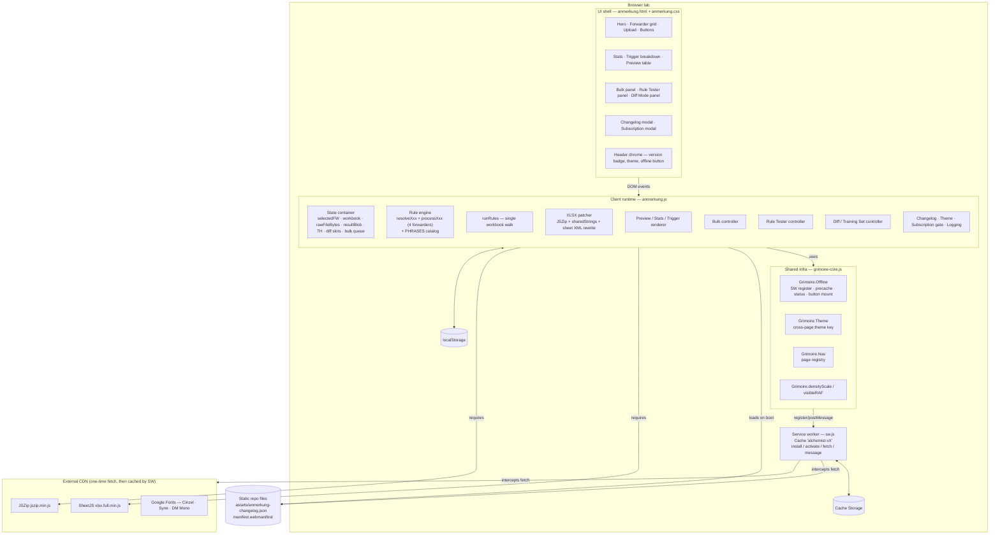
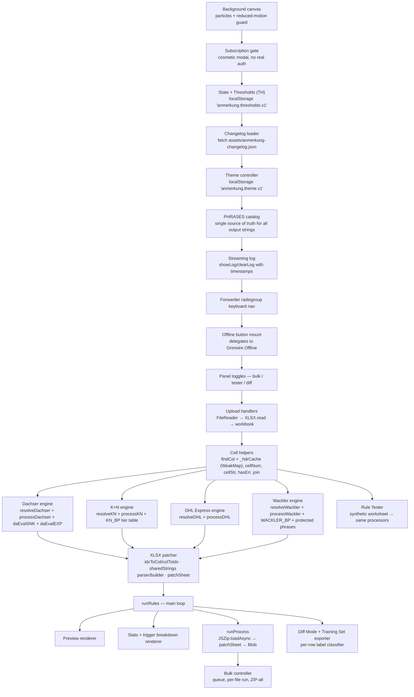
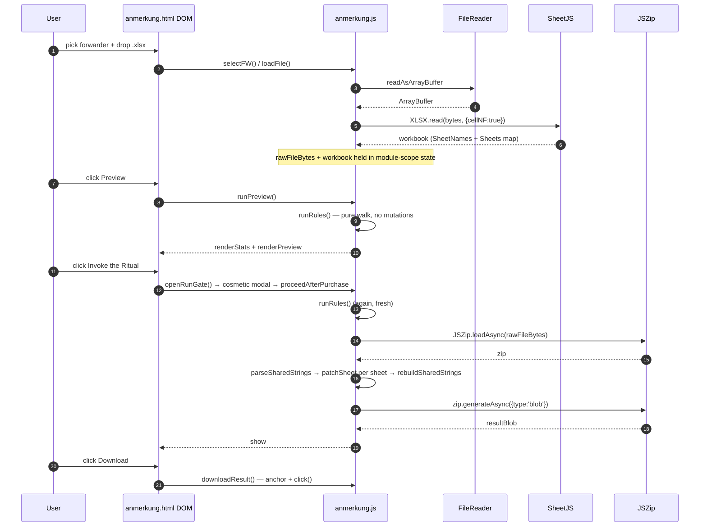
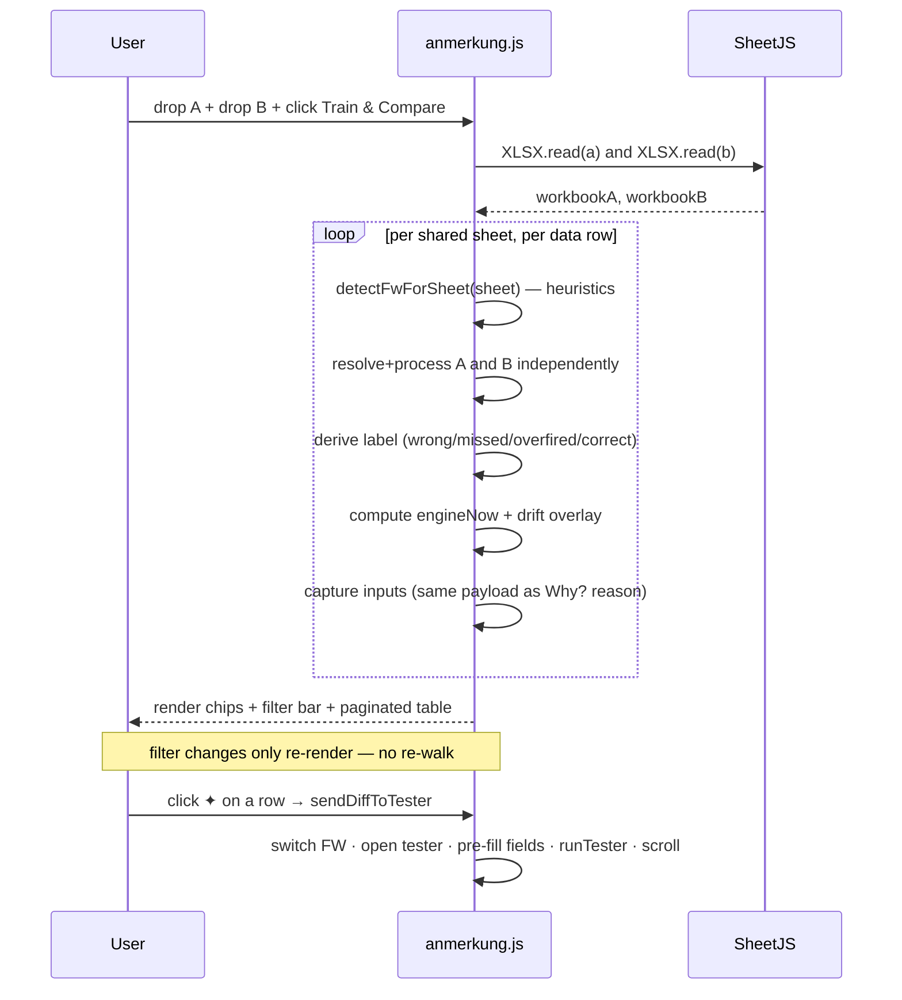
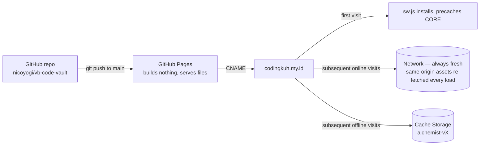
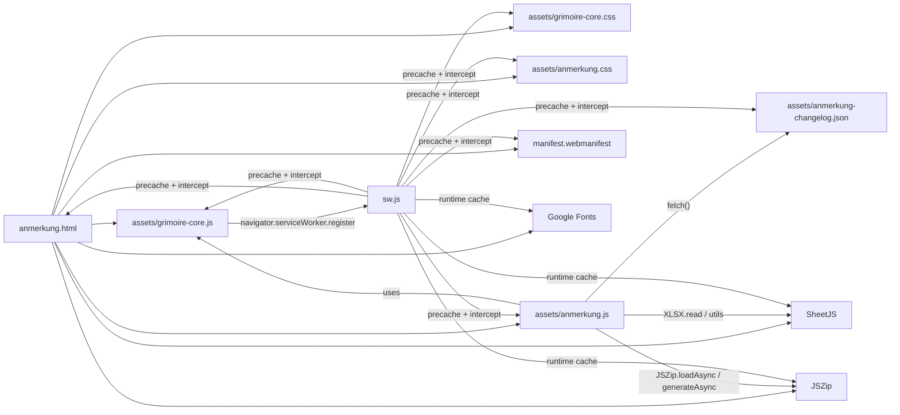

# Anmerkung Processor — Architecture

This document describes the **system-level architecture** of `anmerkung.html` (The Alchemist) — the modules, contracts, runtime envelope, and persistence boundaries.

> Companion to [`ANMERKUNG-WORKFLOW.md`](ANMERKUNG-WORKFLOW.md). The workflow doc explains *what happens* (per-forwarder rule trees + user journey). This doc explains *how it's built* (layers, state, dependency boundaries, extensibility).

---

## 1. System context

| Property | Value |
|---|---|
| Type | Single-page web app (static, no build step) |
| Runtime | Modern browser only — no server, no API |
| Hosting | GitHub Pages (`codingkuh.my.id` → CNAME) |
| Persistence | Browser only (`localStorage` + `Cache Storage`); no remote DB |
| Trust boundary | Everything runs client-side; uploaded XLSX never leaves the browser |
| Offline | Installable PWA via service worker `sw.js` |
| Update model | Always-fresh: same-origin assets are served network-first, so `git push` to `main` reaches users on their next online load with no cache-bust step |

The Alchemist's job: read an XLSX freight-audit workbook, run a per-forwarder rule engine over it, and produce a byte-level patched copy with the `Anmerkung` column filled in — entirely in-browser.

---

## 2. High-level component map



---

## 3. Layer breakdown

### 3.1 UI shell — `anmerkung.html` + `assets/anmerkung.css`

Pure declarative markup. Every interactive element is wired by `id`/`onclick`/`data-*` to a function in `anmerkung.js`. There are **no UI frameworks** — DOM is mutated directly via `getElementById` / `innerHTML`. The CSS uses CSS custom properties so the light theme is a single class swap on `<body>` (`theme-light`).

Notable structural sections (the IDs are the integration contract with the runtime):

| Section | Key DOM IDs |
|---|---|
| Forwarder picker | `#fwGroup`, `.fw-btn[data-fw]` |
| Upload | `#dropArea`, `#fileInput`, `#fileName` |
| Options | `#optReason`, `#advPanel`, `#thDachser` / `#thKN` / `#thDHL` / `#thWackler` |
| Action | `#btnPreview`, `#btnRun`, `#btnDl` |
| Output | `#previewWrap`, `#stats-wrap`, `#trigList`, `#log` |
| Bulk | `#bulkPanel`, `#bulkFileInput`, `#bulkList`, `#btnBulkRun`, `#btnBulkDlAll` |
| Tester | `#testerPanel`, `#testerFields`, `#testerOutput`, `#testerPresets` |
| Diff / Training | `#diffPanel`, `#diffSlotA`/`#diffSlotB`, `#diffTable`, `#trainChips`, `#diffFwFilter` / `#diffSheetFilter` / `#diffSearch`. Bulk sub-panel: `#diffBulk`, `#diffBulkSlotA`/`#diffBulkSlotB`, `#diffBulkPairs`, `#btnBulkDiffRun` |
| Modals | `#cl-overlay` (changelog), `#sub-overlay` (subscription gate) |

### 3.2 Client runtime — `assets/anmerkung.js`

A single ~1900-line module organized into the following internal sub-systems (top to bottom in the file):



**Module-level invariants:**

- The four `processXxx` functions are pure-ish: input is `(ws, r, cols)`, output is a string, `null`, or `''`. They never write to the DOM and never produce side-effects beyond reading worksheet cells.
- `runRules()` is the *only* function that walks every sheet. Preview, Ritual, and Diff all consume its output.
- `patchSheet()` is the *only* function that mutates XLSX bytes.
- All output text comes from the `PHRASES` constant — change wording in one place, every code path picks it up.

### 3.3 Shared infrastructure — `assets/grimoire-core.js`

Used by every Grimoire page. Exposes a small global API:

| Namespace | Purpose | Used by Alchemist? |
|---|---|---|
| `Grimoire.densityScale()` / `visibleRAF()` / `reducedMotion` | Animation density + RAF pause when tab hidden | Yes — background particles |
| `Grimoire.Theme` | Cross-page light/dark with unified `localStorage` key | No — Alchemist uses its own key for historical reasons (`anmerkung.theme.v1`) |
| `Grimoire.Nav` | Page registry used to compute footer links + the default offline bundle | Yes — indirectly via `Offline.defaultUrls()` |
| `Grimoire.Offline` | SW registration, precache request, status check, button mount | Yes — drives `#btnOffline` |

`Grimoire.Offline.mount()` is the one extension point that ties UI to the SW: it writes `data-offline-state="idle|working|ready|error"` on the button and reads/writes the cache via `MessageChannel` to the SW.

### 3.4 Service worker — `sw.js`

A small offline shell — not a sync engine, not a queue, not a router. Optimized for **always-fresh** deploys: returning users get the latest code on every online load, with the cache acting purely as an offline fallback.

**Cache strategy (per request):**

| Request kind | Strategy | Why |
|---|---|---|
| Same-origin (`anmerkung.html`, `anmerkung.js`, `anmerkung.css`, `anmerkung-changelog.json`, `manifest.webmanifest`, `grimoire-core.*`, …) | **network-first**, cache fallback | Every online load gets the latest deployed bytes. The cached copy is only used when the network fails. |
| Cross-origin (SheetJS, JSZip, Google Fonts) | **cache-first**, fall through to network on miss | These URLs are immutable per version, so cache-first is both faster and safe. Caches only `status==200 && type in {basic, cors}`. |
| Navigation while offline + no cached entry | falls back to cached `./anmerkung.html` | Keeps the app bootable offline even on URLs the SW hasn't seen before. |

**Lifecycle:**

- `install` — pre-cache the `CORE` array (page shell + assets + manifest), `skipWaiting`. Network-first means these entries get refreshed on every subsequent online load anyway, so `CORE` is mainly a first-offline-visit safety net.
- `activate` — delete every cache that isn't the current `alchemist-vX`, `clients.claim`.
- `message` — accept `PRECACHE`, `CACHE_STATUS`, `SKIP_WAITING`. Replies use `event.ports[0]` so each request gets its own reply channel.

**The `VERSION` constant is for SW logic changes only.** Because same-origin assets are network-first, content/rule edits ship to users on the next online load *without* a cache invalidation step. Bump `VERSION` only when the SW logic itself changes (e.g., new caching strategy, new `CORE` entries, new message types) — that rotates the cache name and forces a fresh `install` of `CORE` for everyone.

### 3.5 Static data

| File | Role |
|---|---|
| `assets/anmerkung-changelog.json` | Versioned release notes; rendered into the changelog modal. Network-first cached so edits ship instantly. |
| `manifest.webmanifest` | PWA manifest (referenced from the `<link rel="manifest">` in `anmerkung.html`). |
| `data/Dachser-training.csv`, `data/K+N-training.csv` | Reference training corpora used to seed rule changes; not loaded by the app at runtime. |

---

## 4. External dependencies

| Dep | Loaded from | Why |
|---|---|---|
| `xlsx.full.min.js` (SheetJS) | `cdn.sheetjs.com/xlsx-0.20.3` | Read XLSX → in-memory workbook (`workbook.SheetNames`, `workbook.Sheets[name]`) |
| `jszip.min.js` | `cdnjs.cloudflare.com/ajax/libs/jszip/3.10.1` | Unpack the original XLSX, patch sheet XML, rezip without re-encoding styles |
| Google Fonts (`Cinzel`, `Syne`, `DM Mono`) | `fonts.googleapis.com` / `fonts.gstatic.com` | Typography |

Both libraries are loaded with `defer` from CDN. The SW caches them on first successful fetch (cache-first afterwards), so once a user has visited online the app works offline indefinitely.

The choice to **not** bundle these locally is deliberate: zero build pipeline, lightweight repo, free CDN edge caching.

---

## 5. Data flow

### 5.1 Single-file path (Preview + Ritual)



### 5.2 Bulk path

Same as 5.1, looped over the `bulkQueue`. Per-file state lives on each queue entry (`{file, blob, status}`). `Download All as ZIP` builds an outer JSZip containing every successful per-file blob.

### 5.3 Diff Mode path



---

## 6. Key data shapes (the internal contracts)

### `cols` — column index bag (per forwarder, per worksheet)

Returned by `resolveDachser` / `resolveKN` / `resolveDHL` / `resolveWackler`. Always includes `target` (the `Anmerkung` column) and `stat`. Missing columns are `-1`. Every processor treats `-1` as "skip this trigger".

### `rep` — output of `runRules()`

```
{
  total, filled, skipped, empty, preserved, unreachable,   // counters
  allResults: { [sheetName]: { targetCol, rowMap, reasonMap, targetIdx } },
  trigCounts: Map<phrase, count>,
  previewRows: [ { sheet, row, status, value, reason } ]   // status: filled|empty|skipped|preserved
}
```

`rowMap` is a `Map<excelRowNumber, anmerkungString>`. `reasonMap` mirrors it for the Why? column.

### Diff row

```
{
  sheet, row, fw,
  before, after,                       // strings from A / B Anmerkung cells
  engineNow, engineMatchesA,           // current rule engine prediction for A's inputs
  inputs: { [key]: value },            // same payload as the Why? column
  triggers: [phrase, ...],             // for engineNow
  label: 'wrong'|'missed'|'overfired'|'correct'|'drift'
}
```

### Service-worker message protocol

```
Page → SW
  { type: 'PRECACHE',     urls: [...] }        + MessageChannel.port2
  { type: 'CACHE_STATUS', urls: [...] }        + MessageChannel.port2
  { type: 'SKIP_WAITING' }

SW → Page (via port)
  { type: 'PRECACHE_PROGRESS', done, total, url, ok }
  { type: 'PRECACHE_DONE',     done, total, failed: [...] }
  { type: 'CACHE_STATUS_RESULT', cached: [...], missing: [...] }
```

---

## 7. State + persistence map

| State | Where it lives | Lifetime | Notes |
|---|---|---|---|
| `selectedFW` | module-scope `let` in `anmerkung.js` | Tab session | Reset on reload |
| `workbook`, `rawFileBytes`, `originalFileName` | module-scope | Tab session | Cleared when a new file is dropped |
| `resultBlob` | module-scope | Tab session | Replaced on every Ritual run |
| `bulkQueue` (file/blob/status array) | module-scope | Tab session | Removed item-by-item via UI |
| Diff slots (`diffA`, `diffB`, `diffRows`) | module-scope | Tab session | Cleared by *Clear* button |
| Thresholds `TH` | `localStorage['anmerkung.thresholds.v1']` | Persistent per origin | JSON `{dachser, kn, dhl, wackler}` |
| Theme | `localStorage['anmerkung.theme.v1']` | Persistent per origin | `'light' \| 'dark'` |
| Cross-page theme | `localStorage['grimoire_theme_v1']` (set by `Grimoire.Theme`) | Persistent | Not currently consumed by Alchemist |
| Pre-cached page shell | `Cache Storage[alchemist-vX]` | Persistent until SW version bump | Managed by `sw.js` |
| Header cache for `findCol` | `WeakMap<worksheet, headers>` | GC'd with workbook | Per-tab, not persisted |

There is no remote state. There are no cookies. There is no auth.

---

## 8. Cross-cutting concerns

### Logging
`showLog(msg, type)` appends a timestamped `<div>` to `#log`. Three classes: `info-line`, `ok-line`, `err-line`. Has a click-to-clear button auto-injected on first message. `aria-live="polite"` so screen readers announce updates.

### Accessibility
- Forwarder tiles are an ARIA `radiogroup` — arrow keys / Home / End cycle focus.
- `:focus-visible` ring uses a brand-colored 2px outline (green on dark, deep-green on light).
- Modals trap clicks via `event.stopPropagation()` on the inner box; Escape closes both the changelog and subscription overlays.
- Skip link (`.skip-link`) jumps to `#main`.

### Reduced motion
`Grimoire.reducedMotion` (set from `prefers-reduced-motion`) gates the background canvas RAF loop entirely. The single static frame is rendered via `frame(0)` then no further animation runs.

### Theme
Single class on `<body>` (`theme-light`); CSS custom properties switch every color. The `<meta name="theme-color">` tag is updated on toggle for mobile chrome.

### Subscription gate (cosmetic)
`#sub-overlay` opens before `runProcess`. There is **no real auth, no payment, no entitlement check** — clicking *Buy* swaps the modal to a thank-you state and proceeds. This is a UI flourish consistent with the Grimoire theme; calling it out here so future devs don't think there's a missing backend.

---

## 9. Build & deploy

There is no build step.



To ship a content/rule change:

1. Edit files in place.
2. Prepend an entry to [`assets/anmerkung-changelog.json`](../assets/anmerkung-changelog.json) (and bump its top-level `version`) so the in-app "What's new" modal and version badge surface the change.
3. Push to `main`. GitHub Pages serves directly. Users get the new bytes on their next online load — no cache-bust step required, because `sw.js` is network-first for same-origin assets.

To ship a service-worker logic change (rare):

1. Edit `sw.js`. If the `CORE` precache list changed, update it.
2. Bump `VERSION` in `sw.js`. This rotates the cache name (`alchemist-vX` → `alchemist-vY`); the new SW's `activate` step deletes the old cache, and `install` re-fetches `CORE` from the network.
3. Push to `main`. The browser detects the byte-changed `sw.js`, installs the new SW, and `clients.claim` puts existing tabs onto the new fetch logic on their next reload.

The CI workflows in `.github/workflows/` (`holiday-notify.yml`, `tasks-notify.yml`) are unrelated to the Alchemist — they power the daily Teams reminders for the Holiday Tracker and The Ledger respectively. See [`HOLIDAY-TEAMS-NOTIFIER.md`](HOLIDAY-TEAMS-NOTIFIER.md) and [`TASKS-TEAMS-NOTIFIER.md`](TASKS-TEAMS-NOTIFIER.md).

---

## 10. Extensibility recipes

### Add a new forwarder

1. Pick a stable id (e.g. `'rhenus'`). Add a new `<button class="fw-btn" data-fw="rhenus">` tile in `anmerkung.html`.
2. In `anmerkung.js`:
   - Add a default tolerance to `TH_DEFAULTS`.
   - Add a new `<input>` to the advanced panel and wire it in the boot block alongside the existing four.
   - Add `resolveRhenus(ws, range)` returning a `cols` bag (must include `target`, `stat`).
   - Add `processRhenus(ws, r, cols)` that returns a string / `null` / `''`.
   - Extend `runRules`'s dispatch and `buildReason`'s `fw === 'rhenus'` branch.
   - Add the FW to the Rule Tester field map and (optionally) presets.
3. Add new phrases to `PHRASES` if any are reused — but ad-hoc literals inside the processor are also fine.
4. Add an entry to `anmerkung-changelog.json`, bump its `version`.

### Add a new rule to an existing forwarder

Single-line edits inside the `processXxx` function. The rule joins via `res = join(res, P.someNewPhrase)` so de-duplication is automatic. If the new phrase needs a tolerance check, gate with `hasErr(value, T_XXX)`.

### Change phrasing without touching logic

Edit `PHRASES` in `anmerkung.js`. Every code path — engine, tester, diff — picks it up.

### Add a page to the offline bundle

Either:

- Add the page to `Grimoire.Nav.pages` in `grimoire-core.js` (then it ships in `defaultUrls()` for every page automatically), or
- Pass an explicit `urls:` array to `Grimoire.Offline.mount()` for a one-off override (this is what `anmerkung.js` does to add its own CSS/JS/JSON).

Then bump `VERSION` and `CORE` in `sw.js` to pre-cache on install.

### Change a tolerance permanently for everyone

Edit `TH_DEFAULTS` in `anmerkung.js`. Existing users keep their `localStorage` overrides until they hit *Reset to defaults* — version your defaults via the storage key (`anmerkung.thresholds.v2`) if the change must be forced.

---

## 11. Module dependency graph



There are **no circular dependencies**: HTML wires CSS + JS, `anmerkung.js` consumes `grimoire-core.js`, the SW is registered by `grimoire-core.js` and operates independently of the runtime once installed.

---

## See also

- [`ANMERKUNG-WORKFLOW.md`](ANMERKUNG-WORKFLOW.md) — user journey, per-forwarder decision trees, glossary of column codes.
- [`HOLIDAY-TEAMS-NOTIFIER.md`](HOLIDAY-TEAMS-NOTIFIER.md) — unrelated companion page, useful as a reference for the same static-PWA pattern.
- `assets/anmerkung-changelog.json` — release history.
- `assets/anmerkung.js` — the source of truth; rule logic deliberately lives in one file.
