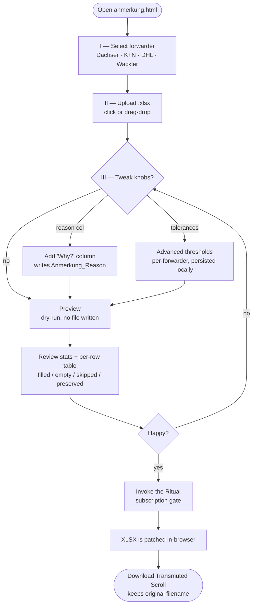
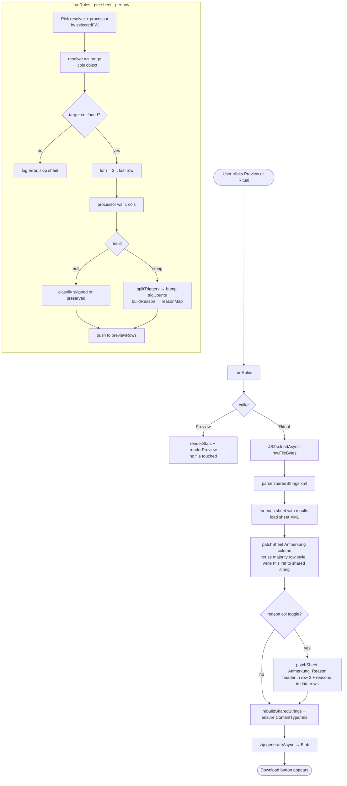
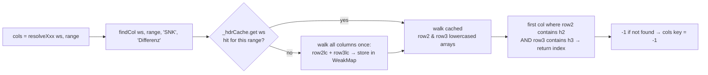
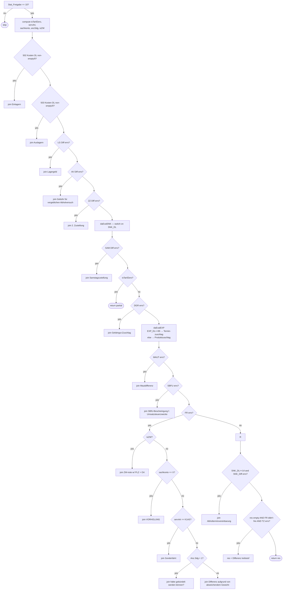
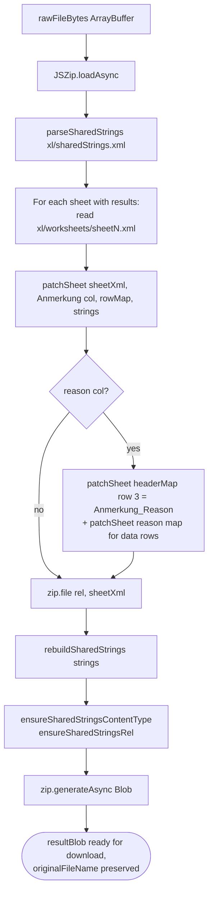

# Anmerkung Processor — Workflow

This document describes how **`anmerkung.html`** (The Alchemist) works, at two levels:

- **Part A — User workflow** — what a human does, start to finish.
- **Part C — Engine workflow** — how the rule engine actually runs, per forwarder, under the hood.

> Audience: Part A is for anyone audit-billing freight invoices. Part C is for anyone tweaking rules or debugging why a row got (or didn't get) a specific Anmerkung.

---

## Part A — User Workflow

### At a glance

> Pick a forwarder → upload an `.xlsx` → (optionally) flip a few switches → **Preview** to see what would happen → **Invoke the Ritual** to write the annotated file → download. The file keeps its original name.

### Happy path



### Step 1 — Pick the forwarder

Four engines, one tile each. **The chosen engine decides every rule that runs**, including which columns are read and what phrase gets written.

| Tile | What the engine is tuned for |
|---|---|
| **Dachser** | `CekKondisi_Freigabe` sheets · ZZ · SAM · DGR · EXP · SNK · SBFU · FR · ZW · TZ · 502/503/LG/AV |
| **K+N** | `FillAnmerkung` sheets · Amazon tiers · bundling · Pauschalfracht · SNK 5/9/18/25/34 · Kontierung |
| **DHL Express** | YO×15 · SNK 25/30/60 · FR/PAL/OW blocker groups |
| **Wackler** | Fremdnummer · AVIS 7.5/8.5/6.5/8.7/1 · SNK 38/−11.5/22 · Gewichte tiers · Bündelung · Return · Kontierung · TZ |

Keyboard: arrow keys / Home / End move between tiles (it's a proper ARIA radiogroup).

### Step 2 — Upload the scroll

Click the dashed box or drag an `.xlsx` in. Only `.xlsx` is accepted. The file is read entirely in-browser — **nothing is uploaded to any server**.

The file name + sheet count appear under the drop zone, and a timestamped log line confirms the load.

### Step 3 — Options (all optional)

- **Add "Why?" reason column** — when the ritual runs, writes an extra `Anmerkung_Reason` column one cell to the right of `Anmerkung`. Contains the raw cell values the rule actually read (e.g. `FR=+12.40 | SNK_DL=14 | SERV=K1AV`). Audit-friendly; doesn't affect which Anmerkung is written.
- **Advanced — tolerance thresholds** — per-forwarder absolute thresholds under which a difference is treated as "no error". Saved in `localStorage` (`anmerkung.thresholds.v1`). Defaults:

| Forwarder | Default threshold |
|---|---|
| Dachser | `0.08` |
| K+N | `0.09` |
| DHL Express | `0.04` |
| Wackler | `0.09` |

**↺ Reset to defaults** restores all four.

### Step 4 — Preview (dry-run)

Click **Preview — dry-run without writing**. No file is produced. You get:

- **3-up stats**: rows scanned · anmerkung filled · skipped (stat ≠ 10)
- **2 mini-stats**: empty (no trigger) · preserved (protected value, Wackler only)
- **Trigger breakdown** — bar chart of which rule fired how many times, sorted descending.
- **Per-row table** (up to 200 rows) with color-coded status dots:
  - `filled` — a rule fired, this would be written
  - `empty` — row is in scope but no rule matched
  - `skipped` — out of scope (usually `Stat_Freigabe ≠ 10`)
  - `preserved` — Wackler row whose existing Anmerkung is protected

Preview is non-destructive — iterate thresholds/options freely.

### Step 5 — Invoke the Ritual

Clicking **Invoke the Ritual** opens the **Subscription Modal** (cosmetic gate). Once acknowledged, the engine:

1. Re-runs the rules (single pass).
2. Unzips the original `.xlsx` in memory (JSZip).
3. Patches only the `Anmerkung` column (and `Anmerkung_Reason` if the toggle is on) cell-by-cell, preserving styles/formatting.
4. Re-zips and produces a downloadable blob.

Click **Download Transmuted Scroll ↓** — the output keeps the **original filename**.

### Alternate flows

#### VI — Bulk Process (multi-file)

Open the "Bulk Process" panel, drop **many** `.xlsx` files, and run the currently-selected forwarder over all of them. Each file gets:

- a live status chip (pending → processing → done / error),
- its own **individual download** button,
- inclusion in the **Download All as ZIP** archive (timestamped name).

Honors the "Why?" toggle and thresholds like the single-file flow.

#### IV — Rule Tester (playground)

A synthetic what-if console. Pick a forwarder, type values into the fields the engine *actually* reads (e.g. `FR Differenz`, `SNK Kosten DL`, `Empf.-Ort`), click **Evaluate**. You get the exact same output the production engine would produce — because the tester calls the same processor against a synthetic worksheet. Presets cover common branches per forwarder (AUSFALLFRACHT, Amazon cross-tier, NL-FIX, Fremdnummer dup, etc.).

No file needed.

#### V — Diff Mode / Rule Training

Drop two processed workbooks:

- **A — Predicted** (your tool's output)
- **B — Expected** (hand-corrected ground truth)

Click **✦ Train & Compare**. The engine walks both files in one pass and labels every row:

| Label | Meaning |
|---|---|
| `wrong` | A and B both filled, but disagree |
| `missed` | A empty, B filled — rule should have fired |
| `overfired` | A filled, B empty — rule fired when it shouldn't |
| `drift` | Current engine would disagree with slot A → rules changed since A was generated |
| `correct` | A and B agree (positive example; off by default, opt-in) |

Output:

- **Click-to-filter chips** (all / wrong / missed / overfired / drift / correct) — the table, counts, and *export buttons* all honor the active filter.
- **Filter bar** — by forwarder, by sheet, and free-text search (scans before/after/reason/engine-now).
- **Per-row expansion** — chevron reveals the exact input cells the engine read + the trigger trace in a k/v grid.
- **Send to Tester** (✦ on any row) — switches to that forwarder, opens the Rule Tester, pre-fills every matching field with the row's inputs, auto-evaluates, and scrolls you there. Tighten the rule → re-run Train & Compare.
- **Exports** (filter-scoped; buttons carry live `· N` counters):
  - `↓ Diff CSV` — classic before/after + forwarder + label + engine_now + engine_matches_a + trigger trace.
  - `↓ Training Set (CSV)` — one row per case with inputs + trace, feed straight into ML / spreadsheet analysis.
  - `↓ Training Set (JSONL)` — one JSON record per line, ML-friendly.

---

## Part C — Engine Workflow

### Source-of-truth table

| What | Where |
|---|---|
| UI | `anmerkung.html` |
| Engine + UI glue | `assets/anmerkung.js` |
| Styling | `assets/anmerkung.css` |
| Release notes (rendered in app) | `assets/anmerkung-changelog.json` |
| Offline shell | `sw.js` + `assets/grimoire-core.js` |

### The sheet model the engine assumes

```
row 1  ┐
row 2  │ header — group label scanned by findCol's h2 argument ("SNK", "FR", "ZZ", ...)
row 3  │ header — sub-label scanned by findCol's h3 argument ("Differenz", "Kosten DL", "Anmerkung", ...)
rows 4+ ─ data
```

Columns are resolved by **header content**, not position — the engine is robust to reshuffled columns as long as row 2 + row 3 labels are intact.

The target `Anmerkung` column is itself located via `findCol(ws, range, '', 'Anmerkung')`. If not found, the sheet is skipped and an error is logged.

### Top-level pipeline (`runRules` → Preview / Ritual)



### Column resolution (`findCol` + header cache)



- **WeakMap keyed on the worksheet object** so the cache is GC'd when the workbook is released.
- All comparisons are case-insensitive and substring-based (`includes`).
- When `h2 === ''`, only row 3 is checked — used for columns with no group header (e.g. `Anmerkung`, `Stat_Freigabe`, `ReferenzNr`).

### Cell-reading primitives

| Helper | Purpose |
|---|---|
| `cellNum(ws, r, c)` | Parse numeric, tolerates `,` decimal separator and stripped non-numerics; returns `0` on empty/NaN. |
| `cellStr(ws, r, c)` | Trimmed string value; empty on missing. |
| `hasErr(v, T)` | `Math.abs(v) > T` — the canonical "this delta counts as an error" test. |
| `join(a, b)` | Appends phrase `b` to `a` with `' // '`, de-duplicates case-insensitively, drops empties. The one-and-only way processors compose multi-trigger Anmerkungen. |
| `idxToCol` / `colToIdx` | 0-indexed ↔ A1 column letters. Used by the XLSX patcher. |

### Phrase catalog (single source of truth)

All output strings live in the `PHRASES` object (aliased as `P`). Rule engines, the Rule Tester, and any future rule editor read from here. Changing wording is a one-line edit — no processor code needs to move.

```js
const PHRASES = {
  ausfallfracht: 'AUSFALLFRACHT',
  snkAutoZustell: 'Differenz Automatische Zustellterminvereinbarung - Laderaumzuschlag',
  // ...
};
```

### Thresholds (persisted, per-forwarder)

```js
const TH_DEFAULTS = { dachser: 0.08, kn: 0.09, dhl: 0.04, wackler: 0.09 };
// loaded from localStorage['anmerkung.thresholds.v1'] on boot
// mutable via the advanced panel, persisted back on every edit
```

Read inside processors as `T_DACHSER / T_KN / T_DHL / T_WACKLER` via `hasErr(v, T_xxx)`.

---

## Per-forwarder decision trees

### Dachser — `resolveDachser` / `processDachser`

**Gate:** `Stat_Freigabe != 10` → skipped (processor returns `null`).

**Column signals read:** `Stat_Freigabe · Total Kosten lt. Tarif · ZZ · DGR · EXP + EXP_DL · SNK (Diff/DL/Tarif) · SBFU · SAM · FR · MT · TZ · 502/503 Kosten DL · LG Diff · AV Diff`. Plus four fixed-index cells: `ReferenzNr3` (col 15), `Empf.-PLZ` (13), `Empf.-Ort` (14), `Anz.Sdg` (3), `Serv.-Art` (16), `Sachkonto` (35).



**SNK sub-cascade (`daEvalSNK`)** — pure switch on `SNK_DL` literal:

| `SNK_DL` | Output |
|---|---|
| 190 or 95 | `AUSFALLFRACHT` |
| 130 | `Standgeld` |
| 75 | `K1AV` → `Speditionskosten gem. Text` · else `Ausfallfracht/Schadensersatz` |
| 11 | `Differenz Telefonische Zustellankündigung - Laderaumzuschlag` (if diff errs) |
| 14 | `K1AV` → `Differenz Laderaumkostenentwicklung` · else → `Differenz Automatische Zustellterminvereinbarung - Laderaumzuschlag` |
| 5 | `K1AV` + `SNK_Tar == 0` → `Admin Zeitfensterbuchung Handel`<br/>`K1AV` + `SNK_Tar != 0` → `Differenz Admin Zeitfensterbuchung Handel - Laderaumzuschlag`<br/>else → `Differenz Automatische Zustellterminvereinbarung - Laderaumzuschlag` |
| 9 | `Differenz Telefonische Zustellterminvereinbarung - Laderaumzuschlag` |
| else | non-integer(DL) && non-integer(Diff) → `Differenz Laderaumkostenentwicklung` · else → `Differenz Automatische Zustellterminvereinbarung - Laderaumzuschlag` |

### K+N — `resolveKN` / `processKN`

**Gate:** `Stat_Freigabe != 10` → skipped.

**Signals:** `Stat · Total Kosten lt. Tarif · Empf.-Name · ReferenzNr · Volumen kg · Volumen kg DL · Kostenstelle · Sachkonto · FR Diff · EXP Diff · MT Diff · SNK Kosten DL · SNK Diff · TZ Diff`.

**Priority order (first match wins within a branch):**

1. **Bundling** — `ReferenzNr` contains a `,` and `FR errs` → `hätte gebündelt werden müssen, ok?` (early return — wins over everything).
2. **FR branch** (only if FR errs):
   - `tarifEmpty` (blank or `-`) → `Pauschalfracht`
   - else `recipient contains "amazon"` + single ReferenzNr:
     - same KN tier (or missing weights) → `hätte nach Amazon Tarif abrechnen müssen`
     - cross tier → `Differenz aufgrund abweichender Gewichte`
   - else `FR > 0 && SNK_DL == 5`: same tier → `hätte nach Amazon Tarif abrechnen dürfen` · else → `Differenz aufgrund abweichender Gewichte`
   - else → `Differenz aufgrund abweichender Gewichte`
3. `EXP errs` → `FIXTERMIN`
4. `MT errs` → `Mautdifferenz`
5. **SNK cascade**:
   - `SNK_Diff ≈ +9` → `Avis, ok?`
   - `SNK_Diff ≈ −9` → `Differenz avis`
   - `|SNK_Diff| ≈ 25` → `Portalavisierung, ok?`
   - else `SNK_Diff errs`:
     - `SNK_DL ∈ {5, 25}` → `Portalavisierung, ok?`
     - `SNK_DL == 9` → `Avis, ok?`
     - `SNK_DL == 18` → `Avis, ok?` (idempotent)
     - `SNK_DL == 34` → `Portalavisierung, ok?` + `Avis, ok?`
     - else → `SNK Differenz`
6. `TZ errs && res still empty` → `Differenz treibstoff`
7. `Kostenstelle or Sachkonto missing/-` → append `Kontierung?`

**KN tier table** (`KN_BP`) — `[50, 100, 150, 200, 250, 300, 350, 400, 450, 500, 600, ..., 9500, 99999]`. `knGetTier(kg)` returns the first breakpoint `>= kg`.

### DHL Express — `resolveDHL` / `processDHL`

**Gate:** `Stat_Freigabe != 10` → skipped.

**Signals:** `Stat · Total Kosten lt. Tarif · SACHKONTO · KOSTENSTELLE · FR (addr) · PAL (stack) · OW (weight) · YO (conv) · YL (irr) · ND (neut) · SF (sign) · SNK · AC (addr-correction) · MT (maut) · NX (surcharge) · OS (oversize) · TZ`.

**Order:**

1. **Fremdnummer dup** — `Tarif` non-empty AND numeric 0 AND text shows `0` or `-` → `Fremdnummer doppelt berechnet.` (early return).
2. Empty `SACHKONTO` or `KOSTENSTELLE` → join `kontierung?`.
3. **Blocker set** (each sets `block = true` if it fires):
   - FR errs → `Differenz aufgrund von abweichendem Gewicht/Volumen`
   - PAL errs → `nicht stapelbar ok?`
   - OW errs → `overweight ok?`
   - YO > 0 AND `YO % 15 == 0` → `Non conveyable piece-weight ok?`
   - else YO errs → `non conveyable piece ok?`
   - YL errs → `Non-conveyable piece irregular ok?`
   - ND errs → `Neutral delivery ok?`
   - SF errs → `Direct signature ok?`
   - `SNK == 25` → `Limited quantities ok?`
   - `SNK == 30` → `Elevated Risk, ok?`
   - `SNK == 60` → `Eelevated risk ok? // Restricted destination ok?`
   - else SNK errs → `SNK Differenz`
4. If **no blocker fired**:
   - `AC == 11` → `Addres Correction, ok?`
   - else AC errs → `Address Correction ok?`
   - MT errs → `Mautdifferenz`
   - NX errs → `demand surcharge ok?`
   - OS errs → `Oversize piece ok?`
5. Fallback — res still empty AND TZ errs → `Differenz treibstof`.

### Wackler — `resolveWackler` / `processWackler`

**Gate (two-part):**

1. **Protected phrases** — if the existing `Anmerkung` already contains any of:
   - `Fremdnummer Doppelt berechnet`
   - `hätte gebündelt werden müssen`
   - `Return, ok?`
   - `Differenz aufgrund abweichender Gewichte`
   - `Wackler rechnet`

   processor returns `null` and the row is classified `preserved` in stats.
2. **Partial Stat gate** — on `Stat_Freigabe != 10`, the rest of the engine is silent except Kontierung:
   - if `KOSTENSTELLE` and `SACHKONTO` are both empty or `X` → return `Kontierung?`
   - otherwise → return `null` (skipped).

**Signals (Stat == 10 path):** `Total Kosten lt. Tarif · AVIS Diff · SNK Diff · FR Diff · MT · TZ · ReferenzNr · Volumen kg · Volumen kg DL · Empf.-PLZ · Empf.-Ort · KOSTENSTELLE · SACHKONTO`.

**Order:**

1. **Fremdnummer dup** — `Tarif == '-'` or (numeric 0 AND text non-empty) → early return `Fremdnummer Doppelt berechnet`.
2. `AVIS ∈ {7.5, 8.5, 6.5, 8.7}` → `Avis, ok?`
3. `SNK_Diff == 38` → `NL-FIX`
4. `SNK_Diff == -11.5` → `hätte B2C-Line abrechnen dürfen`
5. `SNK_Diff == 22` → `2. Zustellung ok?`
6. **Gewichte tier branch** — when VKG and VKG_DL differ AND FR errs:
   - same Wackler tier → `Wackler rechnet` (systemic rounding)
   - cross tier → `Differenz aufgrund abweichender Gewichte`
   - sets `gewichteTriggered = true` (suppresses step 10).
7. **Bundling** (only if step 6 didn't fire) — `ReferenzNr` contains `,` AND FR errs → `hätte gebündelt werden müssen`.
8. `AVIS == 1` → `Differenz avis, ok?`
9. `Empf.-PLZ == '88499'` + `ORT == 'RIEDLINGEN'` → `Return, ok?` (Wackler's return hub).
10. **Fracht fallback** — FR errs AND gewichte not triggered AND res doesn't already mention `gebündelt` or `return` → `Frachtdifferenz`.
11. MT errs → `Mautdifferenz`.
12. **SNK fallback** — `SNK_Diff` not in `{38, -11.5, 22}` AND errs AND res doesn't already mention `gebündelt` → `SNK Differenz`.
13. **Kontierung** — `KOSTENSTELLE` + `SACHKONTO` both empty/`X` → `Kontierung?`.
14. **TZ fallback** — res still empty AND TZ errs → `Differenz treibstof`.

**Wackler tier table** (`WACKLER_BP`) — `[50, 100, 150, 200, 250, 300, 350, 400, 450, 500, 600, ..., 10000, 99999]`. Mirrors K+N structure but with Wackler's own breakpoints.

---

## Output phase — XLSX patching

Writing happens in the **Ritual** path only. Preview stops at `renderStats` / `renderPreview`.



**`patchSheet` — how a single cell is written:**

1. Look for an existing `<c r="{Col}{row}" ...>` element.
   - If found — rewrite attributes, strip any `t="..."`, add `t="s"`, set body to `<v>{sharedStringIdx}</v>`.
   - If not — find the `<row r="{row}">` open tag, compute the majority `s=""` style index from peer cells in that row (keeps column styling consistent), insert a new `<c>` just before the first cell whose column index is greater than the target column. This preserves styles and the ascending-column invariant.
2. `sharedStrings.xml` is updated via `getOrAdd` — new phrases are appended, existing ones are reused (no duplication).
3. Content-types and workbook rels are patched to register `xl/sharedStrings.xml` in case the original file lacked a shared strings part.

Result: the output is a **byte-level diff** of the input — styles, merged cells, formulas, drawings, everything else is untouched.

---

## Diff Mode — the single-pass classifier

`runDiff` walks sheets that exist in **both** A and B. For each data row it computes:

| Field | How |
|---|---|
| `before` | A's `Anmerkung` cell value |
| `after` | B's `Anmerkung` cell value |
| `engineNow` | Current engine's output for A's inputs (the forwarder is detected per-sheet, with fallback to the UI-selected one) |
| `inputs` | K/V dump of cells the processor reads for that forwarder (same data used by the Why? reason column) |
| `triggers` | Trigger trace for `engineNow` |

It then derives the **label** from `(before, after, engineNow)`:

```
before   after    →  label
-------  -------  ------------
  ""      ""      (ignored — both empty)
  ""      !=""    missed
  !=""    ""      overfired
  !=""    !=""    wrong     (if before != after)
  !=""    !=""    correct   (if before == after)
any                drift    (if engineNow != before; overlay on top)
```

The UI chips filter the in-memory result list; every export button (`Diff CSV`, `Training Set CSV`, `Training Set JSONL`) re-serializes whatever the filter currently selects. The button counters always reflect the post-filter row count.

**Send to Tester** uses the `inputs` payload: it flips the forwarder tile, renders tester fields for that forwarder, copies matching keys into the inputs, calls `runTester()`, and scrolls the page. One click from diff-row to interactive rule playground.

---

## Glossary of column codes

| Code | Seen in | Meaning |
|---|---|---|
| `STAT` / `Stat_Freigabe` | all | Approval state — `10` = approved, engine runs; anything else = mostly skipped |
| `FR` | Dachser, K+N, Wackler, DHL (`addr`) | Freight-charge difference |
| `SNK` | all | Surcharge-related columns (`Differenz`, `Kosten DL`, `Kosten lt. Tarif`) |
| `DGR` | Dachser | Dangerous goods difference |
| `EXP` | Dachser, K+N | Express / priority difference |
| `MT` | Dachser, K+N, Wackler, DHL (`maut`) | Maut (toll) difference |
| `TZ` | all | Treibstoffzuschlag (fuel surcharge) |
| `LG` / `AV` | Dachser | Storage / vergeblicher Abholversuch |
| `SBFU` | Dachser | SBfU-Bescheinigung |
| `SAM` | Dachser | Samstagzustellung |
| `ZZ` | Dachser | Zweite Zustellung |
| `YO / YL / ND / SF / PAL / OW / AC / NX / OS` | DHL | Non-conv · irregular · neutral · signature · stackability · overweight · address-correction · surcharge · oversize |
| `AVIS` | Wackler | Avisierungs difference (7.5 / 8.5 / 6.5 / 8.7 / 1 are meaningful literals) |
| `Kostenstelle` / `Sachkonto` | K+N, DHL, Wackler | Cost-center / GL-account — trigger `Kontierung?` when missing |

---

## Quick cross-reference

| I want to… | Go to |
|---|---|
| Audit a single file | [Part A · Step 1–5](#step-1--pick-the-forwarder) |
| Audit a batch | [Part A · Bulk](#vi--bulk-process-multi-file) |
| See what a hypothetical row would produce | [Part A · Rule Tester](#iv--rule-tester-playground) |
| Compare my output vs ground truth | [Part A · Diff Mode](#v--diff-mode--rule-training) |
| Understand why a Dachser row got *X* | [Part C · Dachser tree](#dachser--resolvedachser--processdachser) |
| Debug K+N Amazon vs Gewichte | [Part C · K+N priority 2](#kn--resolvekn--processkn) |
| Find the phrase string to edit | `PHRASES` object in `assets/anmerkung.js` |
| Change a tolerance permanently | `TH_DEFAULTS` in `assets/anmerkung.js` |
